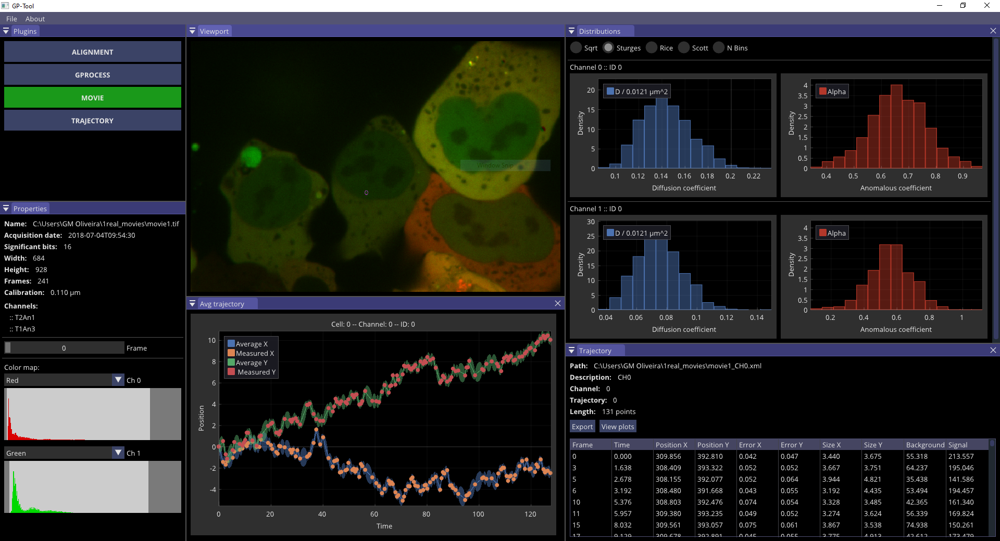

<!-- PROJECT LOGO -->
<h1 align="center">GP-Tool</h1>

  <p align="center">
    GP-Tool: An user-friendly graphical interface to apply GP-FBM
</p>


<!-- TABLE OF CONTENTS -->
<details open="open">
  <summary>Table of Contents</summary>
  <ol>
    <li><a href="#about">About</a></li>
    <li><a href="#natcomm">Nature Communications</a></li>
    <li><a href="#getting-started">Getting Started</a></li>
    <li><a href="#license">License</a></li>
  </ol>
</details>

## About
GP-Tool is a set of methods I developed for the analysis of dynamic particles in the living cells. It comprehends of 4 major libraries:

- MOVIE: Load TIFF files and displays basic metadata along with contrast correction tools. LZW compression is natively handled
- TRAJECTORY: Import tracks produced by Icy Software in the XML format and CSV files with columns "ParticleID, Frame, Position_X, Position_Y"
- ALIGNMENT: Tools to align multi-channeled movies recorded with multiple cameras and corrects for chromatic aberrations;
- GP-FBM: Uses Gaussian processes and Fractional Brownian motion to measure apparent diffusion coefficient, anomalous coefficients and more

For more information, consider the following journal publication and/or "gp_documentation.pdf".


<!-- PUBLICATION -->
## Nature Communications

<h3> Precise measurements of chromatin diffusion dynamics by modeling using Gaussian processes</h3> 

GM Oliveira <i>et al</i>

link: https://doi.org/10.1038/s41467-021-26466-7


<b>Abstract:</b> <i>The spatiotemporal organization of chromatin influences many nuclear processes: from chromo-some segregation to transcriptional regulation. To get a deeper understanding of these processes it is essential to go beyond static viewpoints of chromosome structures, and to accurately characterize chromatin mobility and its diffusion properties. Here, we present GP-FBM: a new computational framework based on Gaussian processes and fractional Brownian motion to analyze and extract diffusion properties from stochastic trajectories of labeled chromatin loci. GP-FBM is able to optimally use the higher-order correlations present in the data and therefore outperforms existing methods. Furthermore, GP-FBM is able to extrapolate trajectories from missing data and account for substrate movement automatically. Using our method we show that diffusive chromatin diffusion properties are surprisingly similar in interphase and mitosis in mouse embryonic stem cells. Moreover, we observe surprising heterogeneity in local chromatin dynamics, which correlates with transcriptional activity. We also present GP-Tool, a user-friendly graphical interface to facilitate the use of GP-FBM by the research community for future studies of nuclear dynamics.</i>


<!-- GETTING STARTED -->
## Getting Started
### Binary packages

Binary packages in Release mode for Windows and Linux are provided in directory packages. Unzip to desired path and you are good to go.

### Source code

1. Clone the repo. As I include several sub-modules as vendors, recursive clone is needed
   ```
   git clone --recurse-submodules -j4 https://github.com/guilmont/GP-Tool.git
   ```

2. To build (or not) the GUI, check the option GP_TOOL. It is set to 'ON' by default

3. Build it with CMake setting CMAKE_BUILD_TYPE (usually Release) and CMAKE_INSTALL_PREFIX. Compile and install

Upon installation, a shared library with all backend methods will be generated under the name 'GPMethods', from which the user can link to any other C++ project. For convenience and debugging purposes, I also recommend installation in 'Debug' and 'RelWithDevInfo' configurations. A 'CMakeLists.txt' is also provided for all built configurations. GP-Tool will be installed only in 'Release' configuration, though. 

### Batching movies
I provide a quick C++ template for running many movies in a batch format. To build using CMake, refer to the cmake config within the installed lib/cmake folder. On Windows, you might need to copy related dll libraries into batching binary folder.
                                                                                              
<!-- todo -->
## Todo
In order of execution (approx):

- GP-Tool: API for saving interpolated trajectories
- GP-Tool: Display movies metadata
- GP-Tool + GPMethods: Improve documentation
- GPMethods: Provided testing API with Google Tests
- GPMethods: Importing other popular file formats containing tracked trajectories
- GPMethods: Wrapper bindings for python (if popularly requested)


<!-- LICENSE -->
## License

Distributed under the Apache2 license. See `License.txt` for more information.


<br/>


---

Copyright 2020-2021 Guilherme MONTEIRO OLIVEIRA
